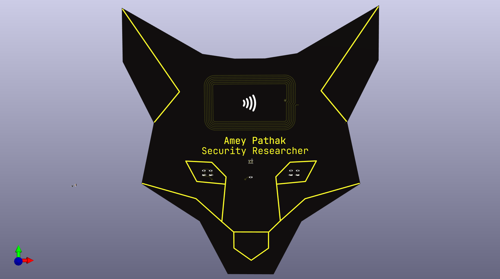

# OSED Badge (In Progress)

A **PCB Badge** designed to wear at Conferences. It contains an integrated **NFC** tag to share information wirelessly, and uses energy harvesting from NFC field to ligh up the led's.

The Designs represents the OSED (Offensive Security Exploit Developer) Mascot. The heart of this PCB is the **NFC** controller IC, the **NT3H1101** from **NXP Semiconductors**.

**NFC (Near Field Communication)** is a short-range radio technology that enables communication between devices that are held in close proximity (< 10 cm). NFC systems are based on traditional High Frequency (HF) RFID, operating at 13.56 MHz.

*Note : Design of this PCB is highly inspired by [Shawn Alex Sony's Business Card](https://github.com/shawnalexsony/Business_Card_PCB), Thanks to Shawn for this amazing design.*